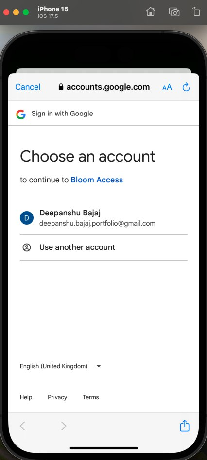

<h1 align="center">🌸 Bloom Access App Lite - Secure Mobile Authentication App</h1>

**Bloom Access** is a modern and secure mobile authentication app built using **React Native with Expo** for the frontend and **Node.js + MongoDB** for the backend. It offers smooth login, signup (and email verification without OTP), Google sign-in, and robust password recovery features.

---

## ✨ Features

## 🔐 Authentication System

- **Sign Up**: Create a new account with email & password.
- **Email Verification**: A verification email after signup; only verified users can log in.
- **Login**: Secure login using email & password.
- **Google Sign-In**: Authenticate easily via your Google account using `expo-google-sign-in`.
- **Forgot Password**: Receive a reset code via email and restore access.
- **Password Reset**: Enter the received code and set a new password.

## 🏠 Home Page (Post Login)

- Displays the user's name and email.
- Confirms successful login and shows minimal profile info.

---

## 🧰 Tech Stack Overview

| Frontend (Mobile)     | Backend (Server)        | Services & Libraries                   |
|-----------------------|-------------------------|----------------------------------------|
| React Native (Expo)   | Node.js + Express       | MongoDB (Mongoose)                     |
| React Navigation      | Nodemailer (for emails) | Google Sign-In (`expo-google-sign-in`) |
| AsyncStorage          | JWT (Authentication)    | Expo CLI                               |

---


## 🚀 Installation & Setup

### 🔧 Prerequisites

Before you begin, ensure you have the following installed and configured:

- **Node.js & npm**  
  Download from [https://nodejs.org](https://nodejs.org)

- **Expo CLI**  
  Install globally using npm:
  ```bash
  npm install -g expo-cli
  ```

- **MongoDB (local or Atlas)**  
  - You can run MongoDB locally or use a cloud-hosted solution like [MongoDB Atlas](https://www.mongodb.com/cloud/atlas).
  - Make sure to have your connection string ready for use in the backend.

- **Your `.env` file for backend secrets**  
  Create a `.env` file in your backend root directory and add the necessary environment variables:

  ```env
  PORT=3000
  MONGO_URI=your_mongodb_connection_string
  AUTH_EMAIL=your_email@example.com
  AUTH_PASS=your_email_password_or_app_specific_password
  DEVELOPMENT_URL=any_url_on_which_server_is_up
  REDIRECT_LINK=any_redirect_url
  ```
- **Your `env.js` file for frontend secrets**  
  Create a `env.js` file in your frontend root directory and add the necessary environment variables:

```js
// env.js
export const ENV = {
  
  // Google client IDs for different platforms
  GOOGLE_WEB_CLIENT_ID: 'web_client_Id',
  GOOGLE_IOS_CLIENT_ID: 'ios_client_Id',
  GOOGLE_ANDROID_CLIENT_ID: 'android_client_Id',
  IOS_SCHEME: 'ios_scheme',
  PROJECT_ID: 'your_project_id',

  // Run - npx expo start (you will get the below value here)
  API_URL: 'your_generated_url',
};
```
---

## 📱 Mobile App Setup:

To get started with the the app, follow these steps:

1. Clone the repository:
   ```bash
   git clone https://github.com/deepanshubajaj/Bloom-Access-App-Other-Variants.git
   ```
### 🚀 Frontend Setup

For Frontend

1. Navigate to the frontend directory:
   ```bash
   cd BloomAccess
   ```
2. Install the required dependencies:
   ```bash
   npm install
   ```
3. Start the Expo project:

    a. In Android:
   ```bash
   npx expo run:android
   ```
   b. In iOS:
   ```bash
   npx expo run:ios
   ```
   c. In expo:
   ```bash
   npx expo start
   ```

### ⚙️ Backend Setup (Node.js + MongoDB)

For Backend

1. Navigate to the dackend directory:
   ```bash
   cd login_server
   ```
2. Install the required dependencies:
   ```bash
   npm install
   ```
3. Start the server:

    a. For development:
   ```bash
   nodemon server.js
   ```
    b. For production:
   ```bash
   node server.js
   ```

---

## 🎨 App Look

<p align="center">
  
</p>
<p align="center">
  *App Icon.*
</p>

<p align="center">
  
</p>
<p align="center">
  *App snapshot in the iOS simulator.*
</p>

## 🖼️ App Screens

<p align="center">
  
</p>
<p align="center">
  *Splash screen displayed upon app launch.*
</p>

<p align="center">
  <div style="display: flex; justify-content: center; gap: 10px;">
    
    
    
  </div>
</p>

<p align="center">
  <div style="display: flex; justify-content: center; gap: 10px;">
    
    
    
  </div>
</p>

<p align="center">
  <div style="display: flex; justify-content: center; gap: 10px;">
    
    
    
  </div>
</p>

<p align="center">
  <div style="display: flex; justify-content: center; gap: 10px;">
    
    
    
  </div>
</p>

<p align="center">
  <div style="display: flex; justify-content: center; gap: 10px;">
    
    
    
  </div>
</p>

<p align="center">
  <div style="display: flex; justify-content: center; gap: 10px;">
    
    
    
  </div>
</p>

<p align="center">
  <div style="display: flex; justify-content: center; gap: 10px;">
    
    
    
  </div>
</p>

<p align="center">
  *Screenshots of the Bloom Access App in iOS Showing different screens.*
</p>

## ⚙️ Server Running

<p align="center">
  
</p>
<p align="center">
  *The app server running in Backend.*
</p>

## 🎥 Demo Working Videos

Here’s a short video showcasing the app's functionality:

<p align="center">
  
</p>

<p align="center">
  *Splash Screen.*
</p>

[Watch Splash screen Video](ProjectOutputs/WorkingVideo/appLoad.mov)

<p align="center">
  
</p>

<p align="center">
  *Complete App Working Video.*
</p>

[Watch Complete screen Video](ProjectOutputs/WorkingVideo/WorkingVideoWithoutOTP.mov)

---

## 🤝 Contributing

Thank you for your interest in contributing to this project!  
I welcome contributions from the community.

- You are free to use, modify, and redistribute this code under the terms of the MIT License.
- If you'd like to contribute, please **open an issue** or **submit a pull request**.
- All contributions will be reviewed and approved by the author — **Deepanshu Bajaj**.

---

## 📃 License

This project is licensed under the [MIT License](./LICENSE).  
You are free to use this project for personal, educational, or commercial purposes — just make sure to provide proper attribution.

> **Clarification:** Commercial use includes, but is not limited to, use in products,  
> services, or activities intended to generate revenue, directly or indirectly.
